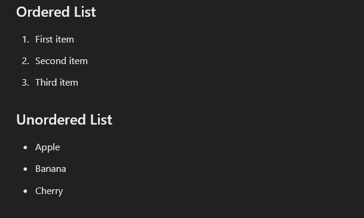
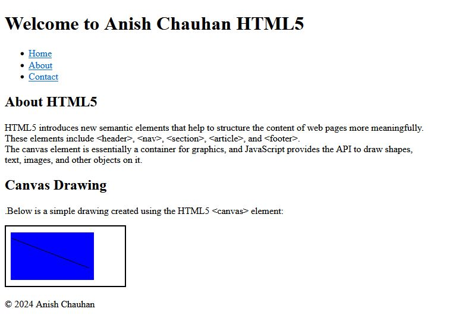
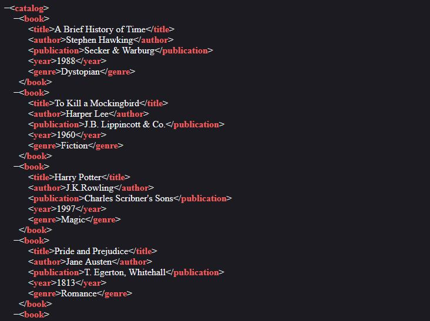
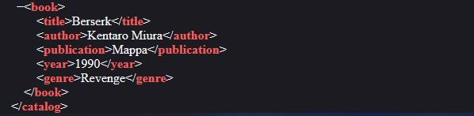
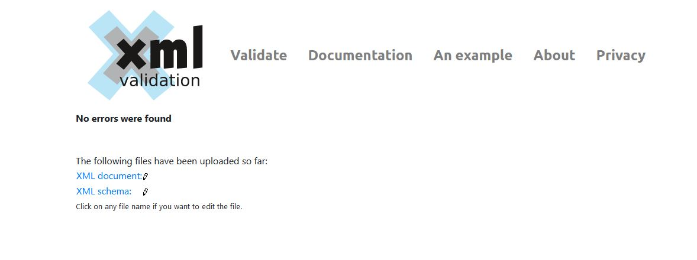
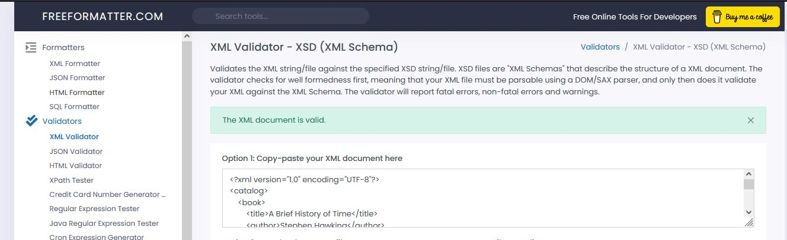
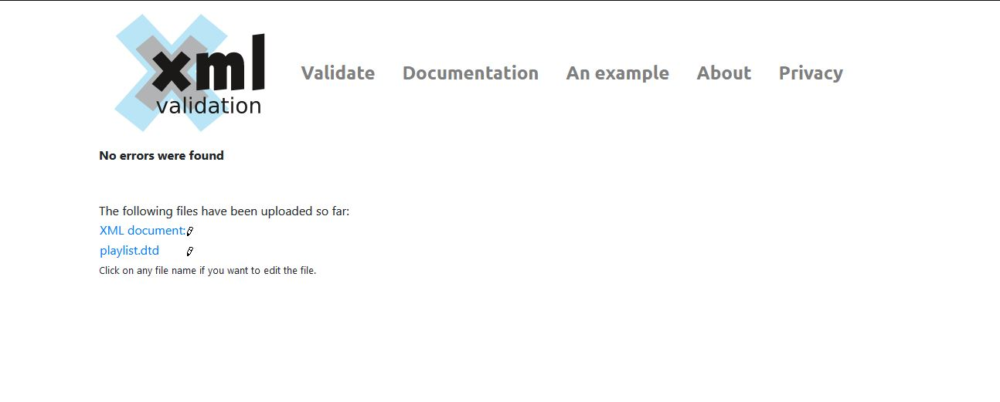

# Qno.1 Simple HTML with title, header, paragraph and list:
``` <!DOCTYPE html>
<html>
<head>
    <title>My Simple HTML Document</title>
</head>
<body>
    <h1>Welcome to My Simple HTML Document</h1>
    <p>This is a paragraph of text in my simple HTML document. HTML stands for HyperText Markup Language and it is the standard language for creating web pages.</p>
    
    <h2>Ordered List</h2>
    <ol>
        <li>First item</li>
        <li>Second item</li>
        <li>Third item</li>
    </ol>
    
    <h2>Unordered List</h2>
    <ul>
        <li>Apple</li>
        <li>Banana</li>
        <li>Cherry</li>
    </ul>
</body>
</html>

```
Output :



# QNo.2 : Implement an HTML 5 that uses new semantics elements like header, nav section article and footer


```
<!DOCTYPE html>
<html>
<head>
    <title>HTML5 Semantic Elements Example</title>
</head>
<body>
    <header>
        <h1>Welcome to My HTML5 Document</h1>
    </header>
    
    <nav>
        <ul>
            <li><a href="#home">Home</a></li>
            <li><a href="#about">About</a></li>
            <li><a href="#contact">Contact</a></li>
        </ul>
    </nav>
    
    <section>
        <article>
            <h2>About HTML5</h2>
            <p>HTML5 introduces new semantic elements that help to structure the content of web pages more meaningfully. These elements include &lt;header&gt;, &lt;nav&gt;, &lt;section&gt;, &lt;article&gt;, and &lt;footer&gt;.</p>
        </article>
        
        <article>
            <h2>Canvas Drawing</h2>
            <p>Below is a simple drawing created using the HTML5 &lt;canvas&gt; element:</p>
            <canvas id="myCanvas" width="200" height="100" style="border:1px solid #000000;">
                Your browser does not support the HTML5 canvas tag.
            </canvas>
        </article>
    </section>
    
    <footer>
        <p>&copy; 2024 My Website</p>
    </footer>

    <script>
        // JavaScript to draw on the canvas
        var canvas = document.getElementById('myCanvas');
        var context = canvas.getContext('2d');
        
        // Draw a rectangle
        context.fillStyle = 'blue';
        context.fillRect(10, 10, 100, 50);
        
        // Draw a line
        context.moveTo(10, 10);
        context.lineTo(110, 60);
        context.stroke();
    </script>
</body>
</html>
```

Output: 



# Qn.3: create a simple xml document to represent a book catalog. Include elements for book title, author, publication, year, and genre. Ensure the document is well- formed.


**catalog.xml :**
```

//please change the fields with your choices

      <?xml version="1.0" encoding="UTF-8"?>
<catalog>
    <book>

    //change the book name 
        <title>A Brief History of Time</title>
        <author>Stephen Hawking</author>
        <publication>Secker &amp; Warburg</publication>
        <year>1988</year>
        <genre>Dystopian</genre>
    </book>

    <book>
        <title>To Kill a Mockingbird</title>
        <author>Harper Lee</author>
        <publication>J.B. Lippincott &amp; Co.</publication>
        <year>1960</year>
        <genre>Fiction</genre>
    </book>

    <book>
        <title>Harry Potter</title>
        <author>J.K.Rowling</author>
        <publication>Charles Scribner's Sons</publication>
        <year>1997</year>
        <genre>Magic</genre>
    </book>
   
    <book>
        <title>Berserk</title>
        <author>Kentaro Miura</author>
        <publication>Mappa</publication>
        <year>1990</year>
        <genre>Revenge</genre>
    </book>
</catalog>

```
You can save this XML content into a file with a .xml extension (e.g., catalog.xml) and open it with an XML viewer or editor to see the structure.
```
How to run XML file in a browser?
Well just select **Open in Default Browser** option.
```

Output: 


 

# Qno.4: Define an XML schema for the book catalog created in the previous question. Validate ana xml file against this schema

To define an XML Schema (XSD) for the book catalog XML document you provided earlier, we'll create a schema that validates the structure and data types of the elements in your XML. Here's how you can define an XSD for your book catalog:

**XML Schema (XSD) fro Book Catalog:**


**catalog.xsd:**

```
<?xml version="1.0" encoding="UTF-8"?>
<xs:schema xmlns:xs="http://www.w3.org/2001/XMLSchema">

    <!-- Define the element book -->
    <xs:element name="book">
        <xs:complexType>
            <xs:sequence>
                <xs:element name="title" type="xs:string"/>
                <xs:element name="author" type="xs:string"/>
                <xs:element name="publication" type="xs:string"/>
                <xs:element name="year" type="xs:integer"/>
                <xs:element name="genre" type="xs:string"/>
            </xs:sequence>
        </xs:complexType>
    </xs:element>

    <!-- Define the element catalog -->
    <xs:element name="catalog">
        <xs:complexType>
            <xs:sequence>
                <xs:element ref="book" minOccurs="1" maxOccurs="unbounded"/>
            </xs:sequence>
        </xs:complexType>
    </xs:element>

</xs:schema>

```

**Validating an XML File Against the Schema:**


I am using online xml validation tools like: 

[XML Validation](https://https://www.xmlvalidation.com/) :



[FreeFormatter](https://https://www.freeformatter.com/): 
 
[FreeFormatter](https://https://www.freeformatter.com/)


But you can use terminal or command prompt too , use xmllint

```
xmllint --schema catalog.xsd catalog.xml --noout

```
**which i tried but feww 😮‍💨 its lengthy process as i need to download other resources too so not doing it**


# Qno.5:  Create a DTD for an XMl document that describes a music playlist

**playlist.xml:**

```
<?xml version="1.0" encoding="UTF-8"?>
<!DOCTYPE playlist SYSTEM "playlist.dtd">
<playlist>
    <song id="s1" genre="Rock">
        <title>Stairway to Heaven</title>
        <artist>Led Zeppelin</artist>
        <duration>8:02</duration>
    </song>
    <song id="s2" genre="Pop">
        <title>Billie Jean</title>
        <artist>Michael Jackson</artist>
        <duration>4:54</duration>
    </song>
    <song id="s3" genre="Hip Hop">
        <title>Lose Yourself</title>
        <artist>Eminem</artist>
        <duration>5:26</duration>
    </song>
    <song id="s4" genre="Classical">
        <title>Fur Elise</title>
        <artist>Beethoven</artist>
        <duration>2:53</duration>
    </song>
</playlist>

```

**playlist.dtd:**
```
<!ELEMENT playlist (song+)>
<!ELEMENT song (title, artist, duration)>
<!ELEMENT title (#PCDATA)>
<!ELEMENT artist (#PCDATA)>
<!ELEMENT duration (#PCDATA)>

<!ATTLIST song id ID #REQUIRED>
<!ATTLIST song genre CDATA #IMPLIED>

```

Validate using :[XML Validation](https://https://www.xmlvalidation.com/) 

**Output:**



# Qno.6: Break down a given URL into its components : schema, host, port, path, query, and fragment.Explain each components purpose

Its theory question, search in google, chat gpt.


```
**No need to Thanks 😎, Bye-Bye 👋**
```


